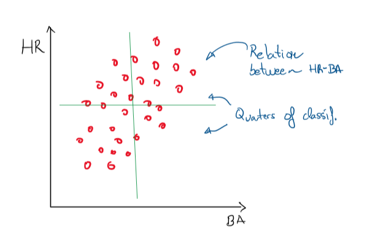

## Files

Original File: http://bl.ocks.org/racc4/5b2c1f9256b21c3acca169fbfefbbc7c

Final File: http://bl.ocks.org/racc4/10a94f1ecd3dc7cb4bab3e32b1b3a6f3

## Summary

The chart is a representation of data containing 1,157 baseball players batting average and home runs. Through this graph it is possible to observe the relation between both parameters and make a classification of players according to the quarter they belong.

## Design
I am not a baseball fan but after performing some exploration of the data set,  I was surprised by the relation between the marks of HR and batting average, so I have focused on trying to create a great visualization about that. 

As the objective is to show the relation between tow variables, an scatter plot could be a good tool, so the plot I had in mind was the following:

Once I got to the original visualization, I tried to improve it following the recommendations in the videos of the module and the feedback of the people I asked.

Improvements: 

- All users agreed that the high density of points in the area below 50 HR make it not easy to be analyzed. So I changed the scale of the Y-axis from linear to logarithmic. By doing that I get a better visualization of this area and the relation of HR and BA can be observed even better.

- I change the color of circles to a softer one and reduce opacity to analyze point density.

- I add a brief description of the data in the header. 

- In order to improve the classification of players I add the values of HR and BA medians to finally get 4 quarters.

- I add information about each quarter. By hovering over the Q tags, it is possible to get information about the players in each zone. (Number of players, and HR and BA means)

## Feedback

In order to get feedback I showed the graph to some colleges and after a brief summary of the case, I asked some questions to get the most of its impressions:

### 1st user Feedback
- He can see the relation between two parameters, but not clearly. There are plenty of points in the area below 50 HR and it is no easy to get conclusions from this zone. Different scale or reducing opacity of points could help.

- In addition he thinks that a bit explanation of the data could be useful in the header.

### 2nd user Feedback
- He finds not easy to perform a classification of players according this graph.

- He agrees that the scatter plot is the best chart to show the relation between both parameters.

### 3rd user Feedback

- He agrees with first user: There are plenty of points in the area below 50 HR and it is no easy to get conclusions from this zone.

- Second thing noticed was the lack of resolution in the X axis labels. (This was actually my mistake)

- About colors, he recommended to use softer colors or reduce opacity.

- Finally, he also recommend to add some description of data in the header and adding also an easy way to visualize the classification of players.

## Resources
- https://stackoverflow.com/ 
- https://github.com/
- https://www.youtube.com/watch?v=_8V5o2UHG0E&t=6056s
- Udacity videos